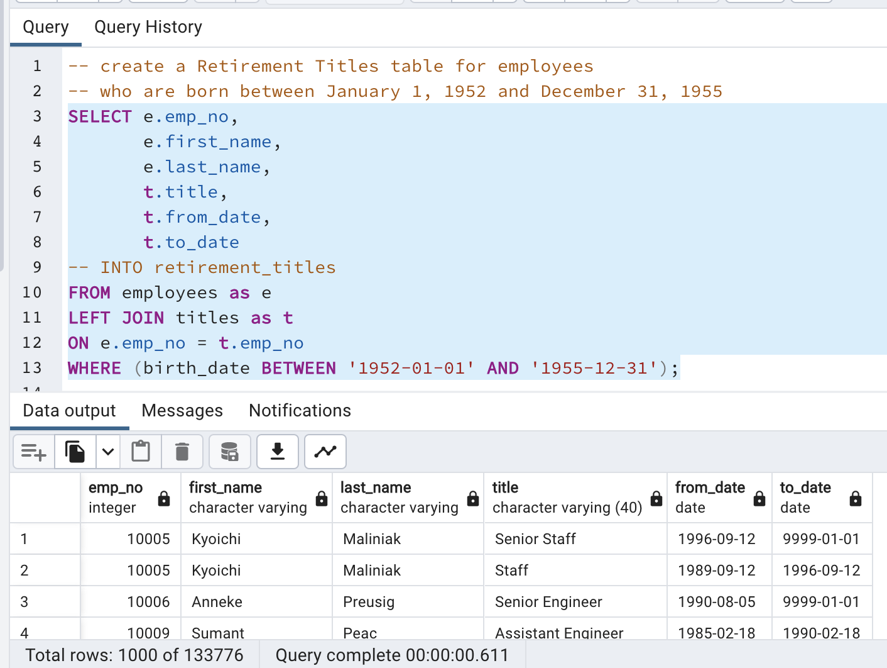

# Pewlett-Hackard-Analysis

## Overview of the analysis
The purpose of this analysis is to determine the number of retiring employees per title, and identify employees who are eligible to participate in a mentorship program. 

## Results
The bulleted list below contains four major points from the two analysis deliverables:

- The Retirement Titles table for employees who are born between January 1, 1952 and December 31, 1955 shows that there are 133,776 titles that are eligible for retirement

- There are 72,458 unique employees that are eligibile for retirement. I can get this number by running the following query on the table `unique_titles`:

    `SELECT COUNT(*) FROM unique_titles;`

- The retiring_titles table provides a list of titles of employees that are retiring. The company has 25,916 Senior Engineer and 24,926 Senior Staff roles that need to be filled.

- There are 1,549 employees eligible for the mentorship program. I can get this number by running the following query on the table `mentorship_eligibility`:

    `SELECT COUNT(*) FROM mentorship_eligibility;`

## Summary
In this section, I provide a high-level summary of the analysis and two additional queries or tables that may provide more insight into the upcoming "silver tsunami."

**How many roles will need to be filled as the "silver tsunami" begins to make an impact?**
The company needs to fill 72,458 roles. The number of roles by title that need to be filled are shown in the table below.

**Are there enough qualified, retirement-ready employees in the departments to mentor the next generation of Pewlett Hackard employees?**

There are only 1,549 employees that are eligible for the mentorship program. The number of retirement ready employees far outweighs the number of employees that are eligible for the mentorship program.

The following two queries provide more insight into the upcoming tsunami:

**What is the number of mentorship eligible employees by department**
To figure out in which department mentorship eligible employees are, I create a query to get mentorship eligible employees by department.  The following table shows the query and the results of the query:

**What are the titles of mentorship eligible employees**
To figure out what titles the mentorship eligible employees currently have and to see if they are in a technical or managerial role I am getting a count of their titles. This will tell us the types of roles the company needs to hire.

